# 💫 About Me:
I am a student at **IIIT Sri City** and an **AI Intern** at **Kookar**, passionate about **future tech**. My focus is on building intelligent **AI agents** and scalable systems.

# 💻 Tech Stack:

### 🤖 AI Agents & LLM Ops
     

### 🧠 Machine Learning & Data
     

### 🌐 Full Stack Development
      

### ☁️ Cloud & DevOps
  

# 📊 GitHub Stats:
<picture>
  <source media="(prefers-color-scheme: dark)" srcset="https://raw.githubusercontent.com/seriouslegend2/seriouslegend2/output/github-contribution-grid-snake-dark.svg">
  <source media="(prefers-color-scheme: light)" srcset="https://raw.githubusercontent.com/seriouslegend2/seriouslegend2/output/github-contribution-grid-snake.svg">
  
</picture>

 

  

---

